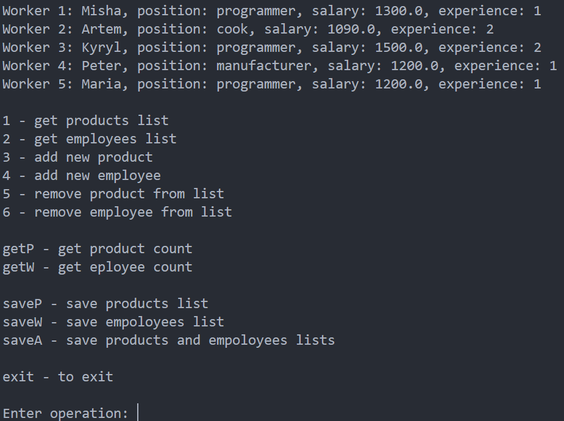
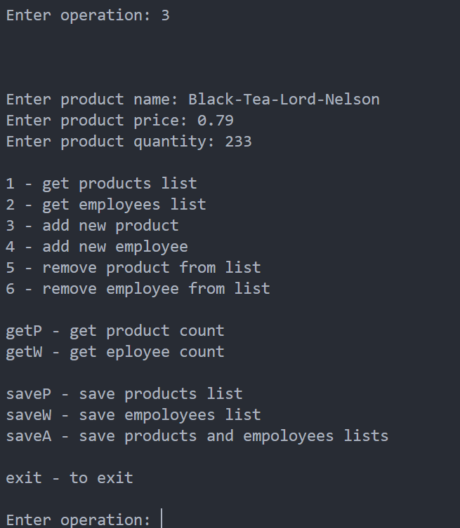
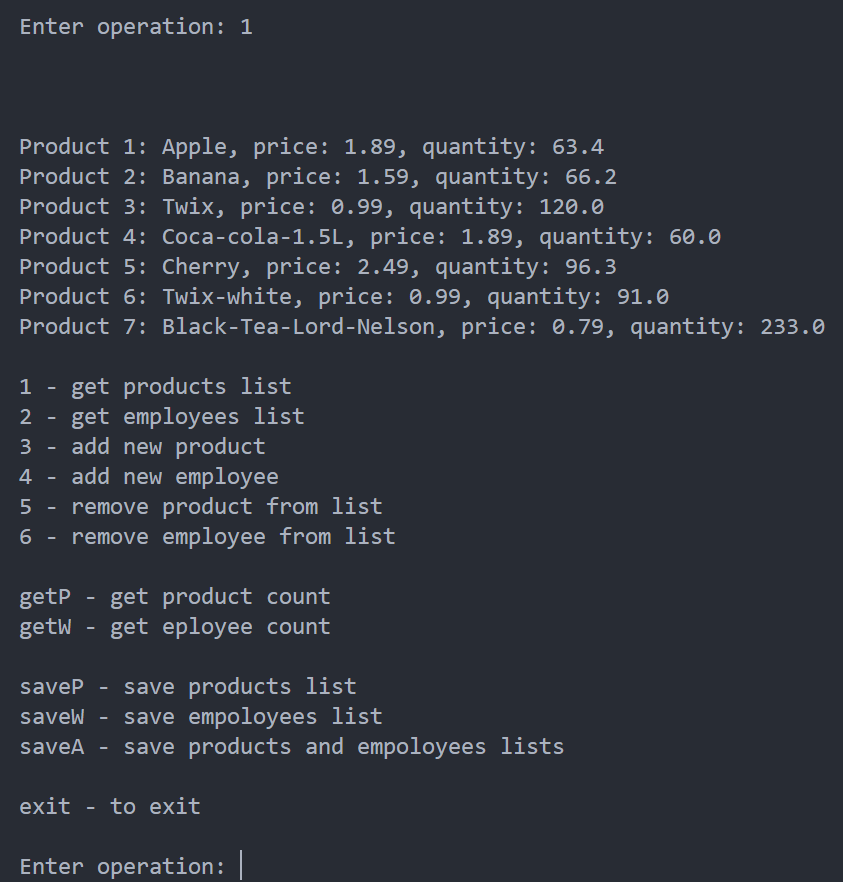
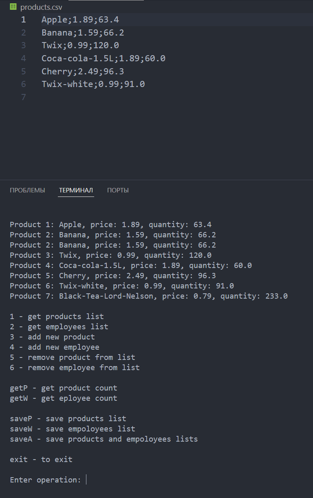
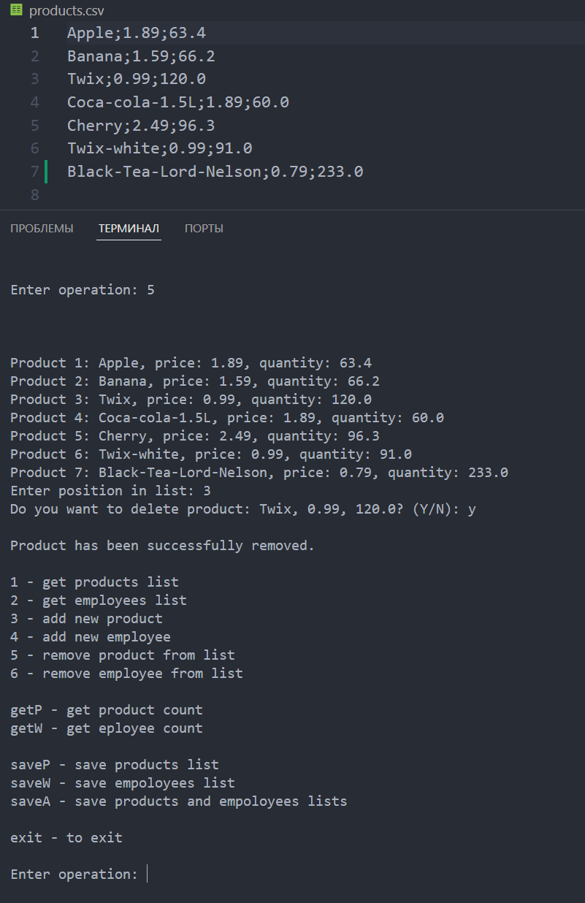
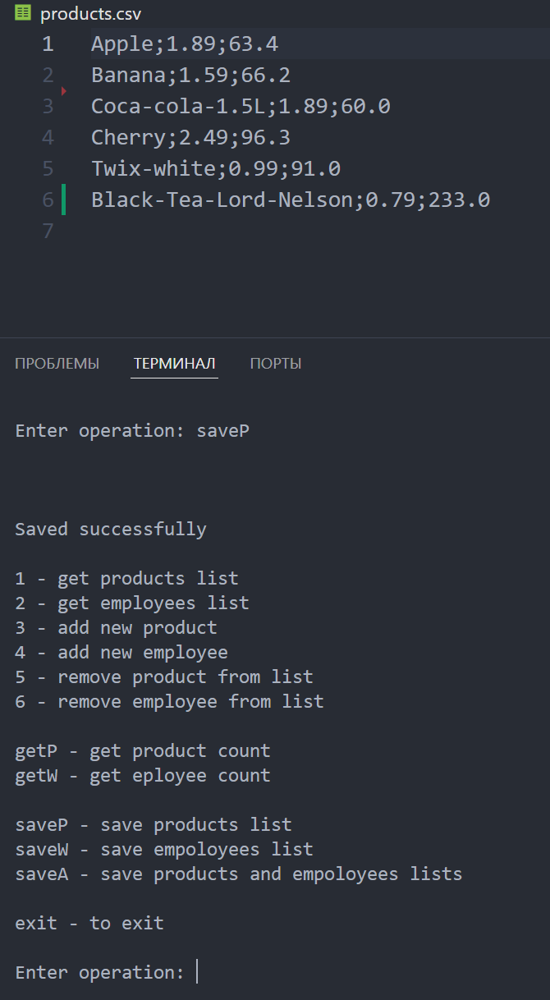

# Úloha
1. Napísať program pre obchod na manažment produktov a zamestnancov. 
2. Dáta musia byť načítané a uložené do príslušného súboru. 
3. Musia existovať kontroly, aby sa predišlo chybám.

***

Priklad 1:

***

Priklad 2:

***
Priklad 3:

***
Priklad 3:

